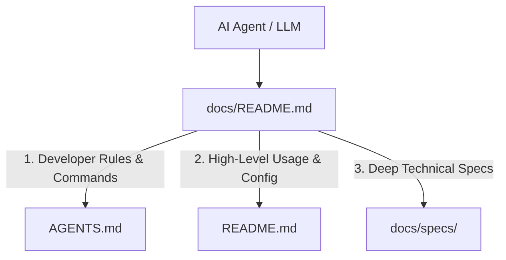

# Documentation & Agent Harness

Welcome to the `security-analyzer` **Documentation Harness**. This directory and its subdirectories provide structured, machine-readable, and human-friendly architectural documentation optimized for ingestion by **Large Language Models (LLMs)**, **AI Agent harnesses**, and **Software Architects**.

---

## 1. Harness Organization & Layout

```
docs/
├── README.md                     # [This file] Documentation harness overview & LLM navigation index
└── specs/                        # Architectural and technical feature specifications (*.md)
```

---

## 2. LLM Ingestion & Navigation Guide

When an LLM or autonomous agent works on this codebase, it should follow this navigation priority:



### Documentation Index

| Resource | Target Audience | Purpose & Scope |
| :--- | :--- | :--- |
| **[AGENTS.md](file:///Users/aponte/personal_workspace/repos/security-analyzer/AGENTS.md)** | Autonomous Coding Agents | Developer commands (`make build`, `make test`, `make lint`), PII safety rules, coding guidelines, and repository conventions. |
| **[README.md](file:///Users/aponte/personal_workspace/repos/security-analyzer/README.md)** | Developers, DevOps, Users | CLI usage modes (`scan`, `mcp`, `analyze`), environment variables, build steps, and CI workflow. |
| **[agent-docs/PRIVATE-ECR-STRATEGY.md](file:///Users/aponte/personal_workspace/repos/security-analyzer/agent-docs/PRIVATE-ECR-STRATEGY.md)** | DevOps, Security Engineers | AWS Private ECR distribution architecture, IAM policies, and consumer execution recipes. |
| **[docs/specs/](file:///Users/aponte/personal_workspace/repos/security-analyzer/docs/specs)** | AI Engineers, Architects, Developers | Deep architectural specifications for repository features, integrations, protocols, and subsystem designs. |

---

## 3. Design Principles for Agentic LLM Optimization

To ensure optimal reasoning, low token overhead, and minimal hallucination when LLMs navigate this harness:

1. **Semantic Headings & Anchor Structure**:
   - Every specification uses standard GitHub Flavored Markdown (GFM) headings (`#`, `##`, `###`) with descriptive titles enabling accurate outline extraction and semantic searching.
2. **Explicit Code Symbol References**:
   - Symbols, interfaces, and file paths are fully qualified with clickable markdown links (`file:///...`) or inline code formatting to allow agents to pinpoint implementation files instantly.
3. **Diagrammatic Flowcharts**:
   - Sequence and architecture diagrams use **Mermaid.js** format (`sequenceDiagram`, `flowchart`), allowing LLMs to parse system workflows and token streams deterministically.
4. **Structured Decision Logs**:
   - Design trade-offs, protocols, and security rules (e.g. strict message role alternation, transport isolation from logging) are documented with problem-solution pairings.

---

## 4. Contributing Technical Specifications

When adding new capabilities or refactoring existing packages:
1. **Create Specification**: Place new architectural design documents in `docs/specs/<feature>-integration.md` following the established heading and diagram standards.
2. **Keep Documentation Self-Contained**: Ensure each specification is fully self-contained with sequence flows, interface models, and testing strategies.
3. **Validate Quality**: Run `make fmt && make vet && make lint && make test` to ensure code changes and tests pass.
