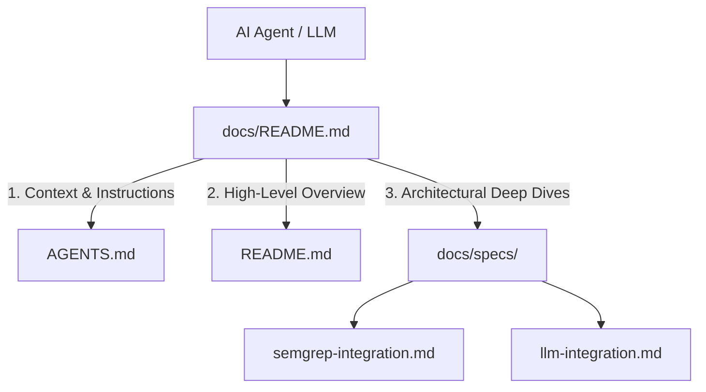

# Documentation & Agent Harness

Welcome to the `security-analyzer` **Documentation Harness**. This directory and its subdirectories provide structured, machine-readable, and human-friendly architectural documentation optimized for ingestion by **Large Language Models (LLMs)**, **AI Agent harnesses**, and **Software Architects**.

---

## 1. Harness Organization & Sitemap

```
docs/
├── README.md                     # [This file] Documentation harness overview & LLM navigation index
└── specs/                        # Formal architectural and technical specifications
    ├── semgrep-integration.md    # SAST scanner integration, CLI execution, MCP server & containment
    └── llm-integration.md        # Multi-provider LLM integration, MCP client, agentic analyzer engine
```

---

## 2. LLM Ingestion & Navigation Guide

When an LLM or autonomous agent works on this codebase, it should follow this navigation priority:



### Quick Lookup Index

| Document | Primary Audience | Key Topics |
| :--- | :--- | :--- |
| **[docs/specs/llm-integration.md](file:///Users/aponte/personal_workspace/repos/security-analyzer/docs/specs/llm-integration.md)** | AI Engineers, Architects, LLM Agents | Multi-provider abstraction (`OpenAI`, `Anthropic`, `Gemini`), MCP client subprocess lifecycle, dynamic tool discovery (`ListTools`), multi-turn analysis loop (`pkg/analyzer`), wire format message coalescing. |
| **[docs/specs/semgrep-integration.md](file:///Users/aponte/personal_workspace/repos/security-analyzer/docs/specs/semgrep-integration.md)** | Security Engineers, Developers, Agents | Semgrep CLI execution, JSON parsing model, path traversal sandboxing (`isSafePath`), reporting channels (`report.md`, `GITHUB_STEP_SUMMARY`), stdio transport isolation. |
| **[AGENTS.md](file:///Users/aponte/personal_workspace/repos/security-analyzer/AGENTS.md)** | Autonomous Coding Agents | Developer commands (`make build`, `make test`, `make lint`), PII safety rules, coding guidelines, formatting requirements. |
| **[README.md](file:///Users/aponte/personal_workspace/repos/security-analyzer/README.md)** | Developers, DevOps, Users | CLI usage modes (`scan`, `mcp`, `analyze`), environment variables, build steps, CI workflow. |

---

## 3. Design Principles for Agentic LLM Optimization

To ensure optimal reasoning, low token overhead, and minimal hallucination when LLMs navigate this harness:

1. **Semantic Headings & Anchor Structure**:
   - Every file uses standard GitHub Flavored Markdown (GFM) headings (`#`, `##`, `###`) with descriptive titles enabling accurate outline extraction and semantic searching.
2. **Explicit Code Symbol References**:
   - Symbols, interfaces, and file paths are fully qualified with clickable markdown links (`file:///...`) or inline code formatting to allow agents to pinpoint implementation files instantly.
3. **Diagrammatic Flowcharts**:
   - Sequence and architecture diagrams use **Mermaid.js** format (`sequenceDiagram`, `flowchart`), allowing LLMs to parse system workflows and token streams deterministically.
4. **Structured Decision Logs**:
   - Design trade-offs, protocols, and security rules (e.g. strict message role alternation for Anthropic/Gemini, stdio transport separation from logging) are documented with problem-solution pairings.

---

## 4. Contributing & Updating Documentation

When adding new features or refactoring existing packages:
1. **Specs First**: Create or update the relevant specification in `docs/specs/<feature>-integration.md`.
2. **Update Index**: Ensure the new specification is referenced in `docs/README.md` and `AGENTS.md`.
3. **Verify Links**: Maintain clickable markdown file references and verify with `make lint` and `make test`.
