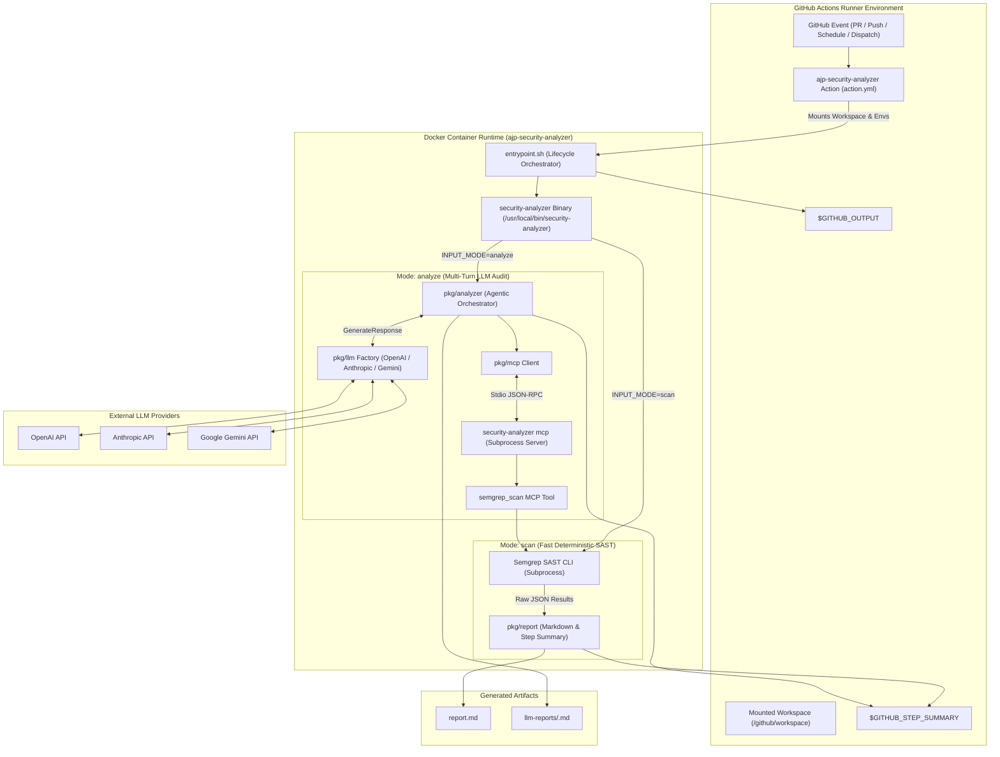
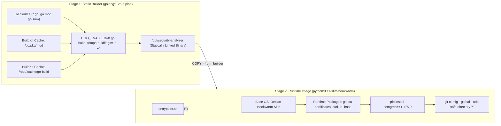
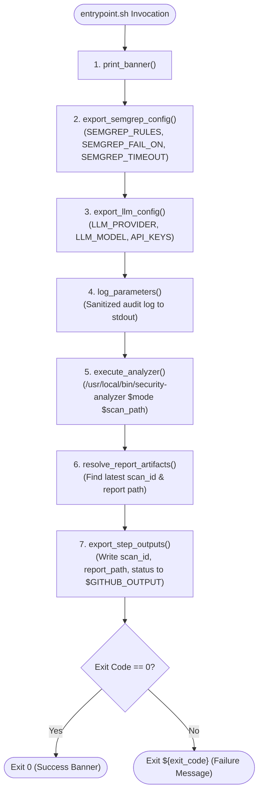
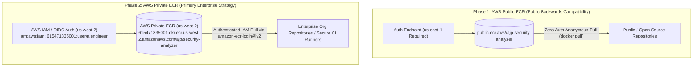
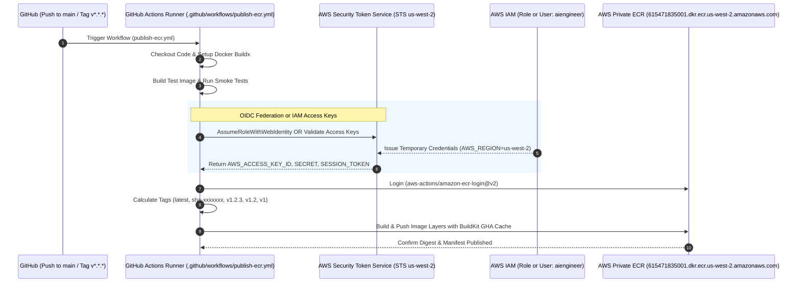
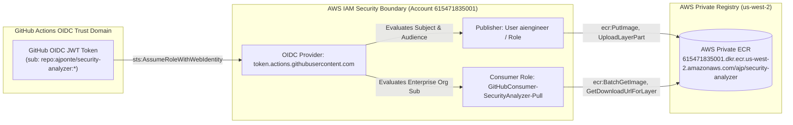

# Architectural Specification: Docker Packaging, GitHub Action Interface, and AWS ECR Distribution Architecture

## 1. Overview & Context

This specification defines the formal architectural design, container encapsulation model, GitHub Action interface, and AWS Elastic Container Registry (ECR) distribution strategy for **`ajp-security-analyzer`**.

`ajp-security-analyzer` is a cloud-native security analysis engine combining deterministic Static Application Security Testing (SAST) via Semgrep with autonomous, multi-turn LLM security audits powered by the Model Context Protocol (MCP). Packaging and distributing this system as a containerized GitHub Action eliminates runner configuration overhead, guarantees deterministic toolchains (`go 1.25`, `python 3.11`, `semgrep 1.175.0`), isolates runtime execution environments, and standardizes security reporting across heterogeneous CI/CD pipelines.

### Primary Goals
- **Zero-Dependency Runner Execution**: Run seamlessly on standard GitHub-hosted (`ubuntu-latest`) and self-hosted runners without pre-installed Go, Python, or Semgrep runtimes.
- **Dual-Mode System Topology**: Support both high-throughput deterministic SAST gates (`scan` mode) and deep contextual AI audits (`analyze` mode) through a single unified interface.
- **Strict Container Isolation & Containment**: Enforce file-system boundaries, path traversal protections, and safe workspace access under GitHub Actions runner UID/GID mappings.
- **Enterprise Private & Phased ECR Distribution**: Establish private distribution via AWS Private ECR (`615471835001.dkr.ecr.us-west-2.amazonaws.com/ajp/security-analyzer`) in `us-west-2` with AWS IAM OpenID Connect (OIDC) federation and IAM user (`arn:aws:iam::615471835001:user/aiengineer`) access, with public registry backwards compatibility.
- **Automated CI/CD Release Publishing**: Orchestrate multi-architecture Buildx image builds, layer caching, semantic version tagging, and automated ECR publishing via GitHub Actions OIDC workflows.

---

## 2. System Topology & Dual-Mode Execution Model

The system operates under a dual-mode topology designed to serve two distinct stages of the software development lifecycle: pull-request blocking SAST scans and asynchronous deep AI security audits.



### Execution Mode Comparison

| Attribute | `scan` Mode (Deterministic SAST) | `analyze` Mode (Agentic AI Audit) |
| :--- | :--- | :--- |
| **Primary Use Case** | Fast PR merge blocking, branch protection gates, pre-commit checks | Scheduled security reviews, major release audits, deep triage |
| **Execution Latency** | Sub-minute (typically 5–30 seconds) | 30–120 seconds (multi-turn model inference) |
| **External Dependencies** | None (100% local execution) | External LLM Provider API (`OPENAI_API_KEY`, etc.) |
| **Subprocess Architecture** | Single subprocess: `semgrep scan --json` | Dual subprocess: MCP Stdio Server + Semgrep CLI |
| **Output Artifacts** | `report.md`, `$GITHUB_STEP_SUMMARY` | `llm-reports/<scan_id>.md`, `$GITHUB_STEP_SUMMARY` |
| **Failure Semantics** | Evaluates findings against `INPUT_FAIL_ON` threshold (`ERROR`, `WARNING`, `INFO`) | Returns non-zero on unhandled analyzer errors or threshold violations |
| **Resource Profile** | Low CPU/Memory footprint (< 512MB RAM) | Moderate CPU/Memory footprint (1–2GB RAM during tool chaining) |

---

## 3. Multi-Stage Container Architecture

To satisfy strict performance and security constraints, the container is built using a multi-stage Docker build pipeline:

1. **Stage 1 (`builder`)**: Compiles a static Go binary using `golang:1.25-alpine` with all debug symbols stripped and CGO disabled.
2. **Stage 2 (`runtime`)**: Employs `python:3.11-slim-bookworm` containing runtime toolchains (Semgrep CLI, Git, CA Certificates, JQ, Curl) while discarding Go build tools and intermediate source code.



### Complete Dockerfile Specification ([Dockerfile](file:///Users/aponte/personal_workspace/repos/security-analyzer/Dockerfile))

```dockerfile
# ==========================================
# Stage 1: Build Static Go Binary
# ==========================================
FROM golang:1.25-alpine AS builder

WORKDIR /src

# Install build dependencies for static linking and git metadata
RUN apk add --no-cache git ca-certificates tzdata

# Cache Go module dependencies
COPY go.mod go.sum ./
RUN --mount=type=cache,target=/go/pkg/mod \
    go mod download -x

# Copy source tree
COPY . .

# Build statically compiled binary (CGO disabled, stripped debug symbols)
RUN --mount=type=cache,target=/go/pkg/mod \
    --mount=type=cache,target=/root/.cache/go-build \
    CGO_ENABLED=0 GOOS=linux \
    go build -trimpath -ldflags="-s -w -extldflags '-static'" -o /out/security-analyzer main.go

# ==========================================
# Stage 2: Runtime Image (Python 3.11 + Semgrep)
# ==========================================
FROM python:3.11-slim-bookworm AS runtime

LABEL org.opencontainers.image.title="ajp-security-analyzer" \
      org.opencontainers.image.description="LLM-based security scanner and Semgrep SAST orchestrator for GitHub Actions" \
      org.opencontainers.image.source="https://github.com/ajponte/security-analyzer" \
      org.opencontainers.image.licenses="MIT"

# Set environment variables for non-interactive execution and Python optimization
ENV DEBIAN_FRONTEND=noninteractive \
    PYTHONUNBUFFERED=1 \
    PYTHONDONTWRITEBYTECODE=1 \
    PATH="/usr/local/bin:/usr/bin:/bin:${PATH}" \
    SEMGREP_ENABLE_VERSION_CHECK=0

# Install runtime dependencies: Git (required for Semgrep repo discovery), CA certs, Curl, JQ, Bash
RUN apt-get update && apt-get install -y --no-install-recommends \
    ca-certificates \
    git \
    curl \
    jq \
    bash \
    && rm -rf /var/lib/apt/lists/*

# Install Semgrep CLI via pip into global Python environment
RUN --mount=type=cache,target=/root/.cache/pip \
    pip install --no-cache-dir --upgrade pip setuptools && \
    pip install --no-cache-dir semgrep==1.175.0

# Configure global git safe directory to avoid permissions mismatch in GHA workspace mounts
RUN git config --global --add safe.directory '*'

# Copy statically linked binary from builder stage
COPY --from=builder /out/security-analyzer /usr/local/bin/security-analyzer
RUN chmod +x /usr/local/bin/security-analyzer

# Copy entrypoint script
COPY entrypoint.sh /entrypoint.sh
RUN chmod +x /entrypoint.sh

# Default working directory mapped by GitHub Actions
WORKDIR /github/workspace

ENTRYPOINT ["/entrypoint.sh"]
```

### Container Hardening & Optimization Invariants
1. **Static Binary Compilation**: `CGO_ENABLED=0` coupled with `-extldflags '-static'` guarantees zero dynamic linking dependencies (`libc`, `musl`, `glibc`), allowing the binary to execute reliably in any Linux runtime environment.
2. **BuildKit Layer Caching**: Utilizes `--mount=type=cache,target=/go/pkg/mod` and `/root/.cache/go-build` to enable sub-second re-compilations during local development and CI runs.
3. **Deterministic Toolchain Pinning**: `semgrep` is pinned to `1.175.0` to guard against breaking CLI flag modifications or AST rule evaluation changes across releases.
4. **Git Safe Directory Containment**: Running inside container runners often maps `/github/workspace` with ownership belonging to host UID `1001` while the container runs as `root`. Executing `git config --global --add safe.directory '*'` neutralizes `fatal: detected dubious ownership in repository` errors during Semgrep differential analysis.
5. **No Telemetry / Offline Execution**: `SEMGREP_ENABLE_VERSION_CHECK=0` prevents outbound version polling overhead and preserves runner network privacy.

---

## 4. GitHub Action Interface & Execution Contract

### 4.1 Action Metadata Contract ([action.yml](file:///Users/aponte/personal_workspace/repos/security-analyzer/action.yml))

The GitHub Action definition defines the inputs, outputs, branding, and container runtime bindings:

```yaml
name: 'AJP Tech Security Analyzer'
description: 'AI-driven SAST scanner combining Semgrep analysis and LLM security audits'
author: 'ajponte'
branding:
  icon: 'shield'
  color: 'blue'

inputs:
  mode:
    description: 'Execution mode: "scan" (direct Semgrep SAST) or "analyze" (agentic LLM audit)'
    required: false
    default: 'scan'
  scan_path:
    description: 'Target repository directory or file path to scan'
    required: false
    default: '.'
  provider:
    description: 'LLM Provider for analyze mode: "openai", "anthropic", or "gemini"'
    required: false
    default: 'openai'
  model:
    description: 'Model identifier override (e.g., "gpt-4o-mini", "claude-3-5-sonnet-latest", "gemini-2.5-flash")'
    required: false
    default: ''
  openai_api_key:
    description: 'API key for OpenAI (required if provider is openai)'
    required: false
    default: ''
  anthropic_api_key:
    description: 'API key for Anthropic (required if provider is anthropic)'
    required: false
    default: ''
  gemini_api_key:
    description: 'API key for Google Gemini (required if provider is gemini)'
    required: false
    default: ''
  rules:
    description: 'Semgrep ruleset configuration (e.g., "auto", "p/golang", "p/security-audit")'
    required: false
    default: 'auto'
  fail_on:
    description: 'Severity failure threshold: "ERROR", "WARNING", or "INFO"'
    required: false
    default: 'ERROR'
  timeout:
    description: 'Maximum scan timeout duration (e.g., "5m", "10m")'
    required: false
    default: '10m'
  semgrep_app_token:
    description: 'Optional Semgrep Cloud Platform App Token'
    required: false
    default: ''

outputs:
  scan_id:
    description: 'Unique identifier for the scan execution'
  report_path:
    description: 'Path to generated Markdown report file'
  status:
    description: 'Execution exit status ("success" or "failure")'

runs:
  using: 'docker'
  image: 'Dockerfile'
  env:
    INPUT_MODE: ${{ inputs.mode }}
    INPUT_SCAN_PATH: ${{ inputs.scan_path }}
    INPUT_PROVIDER: ${{ inputs.provider }}
    INPUT_MODEL: ${{ inputs.model }}
    INPUT_OPENAI_API_KEY: ${{ inputs.openai_api_key }}
    INPUT_ANTHROPIC_API_KEY: ${{ inputs.anthropic_api_key }}
    INPUT_GEMINI_API_KEY: ${{ inputs.gemini_api_key }}
    INPUT_RULES: ${{ inputs.rules }}
    INPUT_FAIL_ON: ${{ inputs.fail_on }}
    INPUT_TIMEOUT: ${{ inputs.timeout }}
    INPUT_SEMGREP_APP_TOKEN: ${{ inputs.semgrep_app_token }}
```

### 4.2 Entrypoint Lifecycle Architecture ([entrypoint.sh](file:///Users/aponte/personal_workspace/repos/security-analyzer/entrypoint.sh))

The entrypoint acts as the orchestration layer between GitHub Actions runner input conventions (`INPUT_*`) and the Go application's configuration model ([pkg/config/config.go](file:///Users/aponte/personal_workspace/repos/security-analyzer/pkg/config/config.go)).



#### Functional Decomposition of `entrypoint.sh`

1. **`print_banner`**: Prints clean initialization headers for CI log visibility.
2. **`export_semgrep_config`**: Maps `INPUT_RULES`, `INPUT_FAIL_ON`, `INPUT_TIMEOUT`, and `INPUT_SEMGREP_APP_TOKEN` to system environment variables.
3. **`export_llm_config`**: Routes provider credentials (`OPENAI_API_KEY`, `ANTHROPIC_API_KEY`, `GEMINI_API_KEY`) and model identifiers into the runtime environment.
4. **`log_parameters`**: Audits execution mode, scan targets, rulesets, and provider configurations without printing sensitive API keys.
5. **`execute_analyzer`**: Executes `/usr/local/bin/security-analyzer`, capturing the exact exit code while temporarily disabling `set -e` to prevent abrupt script termination prior to output artifact discovery.
6. **`resolve_report_artifacts`**:
   - In `analyze` mode: Inspects `llm-reports/` for the latest `scan-YYYYMMDD-HHMMSS-*.md` report and extracts the `scan_id`.
   - In `scan` mode: Standardizes on `report.md`.
7. **`export_step_outputs`**: Safely writes `scan_id`, `report_path`, and `status` to `$GITHUB_OUTPUT` if the runner environment variable is defined.
8. **`main`**: Enforces error handling, invokes lifecycle functions sequentially, and propagates the binary's terminal exit code.

---

## 5. AWS ECR Phased Distribution Architecture

Distribution is architected to support enterprise-grade private container governance in AWS Region **`us-west-2`** alongside backwards compatibility with public workflows.



### AWS Private ECR Infrastructure Coordinates

| Parameter | Specification | Details |
| :--- | :--- | :--- |
| **Repository Name** | `ajp/security-analyzer` | ECR namespace repository |
| **Repository ARN** | `arn:aws:ecr:us-west-2:615471835001:repository/ajp/security-analyzer` | Target ARN for IAM policies |
| **Repository URI** | `615471835001.dkr.ecr.us-west-2.amazonaws.com/ajp/security-analyzer` | Docker pull/push target endpoint |
| **AWS Region** | `us-west-2` (Oregon) | Regional control plane and data storage |
| **AWS Account ID** | `615471835001` | Dedicated AWS account |
| **IAM User** | `arn:aws:iam::615471835001:user/aiengineer` | Dedicated IAM identity |
| **Required Policy** | `AmazonEC2ContainerRegistryPowerUser` | Managed push/pull privileges |

> [!NOTE]
> For in-depth technical implementation and operational runbooks, see [agent-docs/PRIVATE-ECR-STRATEGY.md](file:///Users/aponte/personal_workspace/repos/security-analyzer/agent-docs/PRIVATE-ECR-STRATEGY.md).

---

## 6. CI/CD Publishing Pipeline

The container publishing pipeline is automated via [.github/workflows/publish-ecr.yml](file:///Users/aponte/personal_workspace/repos/security-analyzer/.github/workflows/publish-ecr.yml), building the container and publishing directly to the private registry in `us-west-2`.



### Publishing Pipeline Workflow ([.github/workflows/publish-ecr.yml](file:///Users/aponte/personal_workspace/repos/security-analyzer/.github/workflows/publish-ecr.yml))

```yaml
name: Build & Publish Container to AWS Private ECR

on:
  push:
    branches:
      - main
    tags:
      - 'v*.*.*'
  pull_request:
    branches:
      - main
  workflow_dispatch:

permissions:
  id-token: write # Required for AWS OIDC authentication
  contents: read  # Required for actions/checkout

env:
  AWS_REGION: us-west-2
  ECR_REPOSITORY: 615471835001.dkr.ecr.us-west-2.amazonaws.com/ajp/security-analyzer
  IMAGE_NAME: ajp/security-analyzer

jobs:
  build-and-test:
    name: Build & Validate Image
    runs-on: ubuntu-latest
    steps:
      - name: Checkout Source Code
        uses: actions/checkout@v4

      - name: Set up Docker Buildx
        uses: docker/setup-buildx-action@v3

      - name: Build Test Image
        uses: docker/build-push-action@v5
        with:
          context: .
          file: ./Dockerfile
          push: false
          tags: ${{ env.IMAGE_NAME }}:test
          load: true
          cache-from: type=gha
          cache-to: type=gha,mode=max

      - name: Smoke Test Image Execution
        run: |
          docker run --rm ${{ env.IMAGE_NAME }}:test --help || true

  publish-private-ecr:
    name: Publish to AWS Private ECR
    needs: build-and-test
    if: github.event_name != 'pull_request'
    runs-on: ubuntu-latest
    steps:
      - name: Checkout Source Code
        uses: actions/checkout@v4

      - name: Set up Docker Buildx
        uses: docker/setup-buildx-action@v3

      - name: Configure AWS Credentials
        uses: aws-actions/configure-aws-credentials@v4
        with:
          role-to-assume: ${{ secrets.AWS_ROLE_TO_ASSUME }}
          aws-access-key-id: ${{ secrets.AWS_ACCESS_KEY_ID }}
          aws-secret-access-key: ${{ secrets.AWS_SECRET_ACCESS_KEY }}
          aws-region: ${{ env.AWS_REGION }}
          audience: sts.amazonaws.com

      - name: Login to AWS Private ECR
        uses: aws-actions/amazon-ecr-login@v2

      - name: Extract Docker Metadata (Tags & Labels)
        id: meta
        uses: docker/metadata-action@v5
        with:
          images: ${{ env.ECR_REPOSITORY }}
          tags: |
            type=raw,value=latest,enable=${{ github.ref == 'refs/heads/main' }}
            type=sha,prefix=sha-,format=short
            type=semver,pattern={{version}}
            type=semver,pattern={{major}}.{{minor}}
            type=semver,pattern={{major}}

      - name: Build & Push Image to Private ECR
        uses: docker/build-push-action@v5
        with:
          context: .
          file: ./Dockerfile
          push: true
          tags: ${{ steps.meta.outputs.tags }}
          labels: ${{ steps.meta.outputs.labels }}
          cache-from: type=gha
          cache-to: type=gha,mode=max
```

---

## 7. Consumer Workflow Patterns & Integration Blueprints

### 7.1 Pattern A: Fast SAST PR Gate via Private ECR

Consuming repositories authenticate against `us-west-2`, log into ECR, and execute the private container:

```yaml
name: Security SAST Gate (Private ECR)

on:
  pull_request:
    branches: [ main ]
  push:
    branches: [ main ]

permissions:
  id-token: write # Required if authenticating via OIDC
  contents: read

jobs:
  sast:
    name: Fast SAST Gate
    runs-on: ubuntu-latest
    steps:
      - name: Checkout Source Code
        uses: actions/checkout@v4

      - name: Configure AWS Credentials
        uses: aws-actions/configure-aws-credentials@v4
        with:
          role-to-assume: arn:aws:iam::615471835001:role/GitHubConsumer-SecurityAnalyzer-Pull
          aws-region: us-west-2
          audience: sts.amazonaws.com

      - name: Log in to AWS Private ECR
        id: login-ecr
        uses: aws-actions/amazon-ecr-login@v2

      - name: Run Security Analyzer Container
        run: |
          docker run --rm \
            -v "${{ github.workspace }}:/github/workspace" \
            -e GITHUB_STEP_SUMMARY="/github/workspace/step-summary.md" \
            -e INPUT_MODE="scan" \
            -e INPUT_SCAN_PATH="." \
            -e INPUT_RULES="auto" \
            -e INPUT_FAIL_ON="ERROR" \
            -e INPUT_TIMEOUT="5m" \
            615471835001.dkr.ecr.us-west-2.amazonaws.com/ajp/security-analyzer:latest

      - name: Append Job Summary
        if: always()
        run: |
          if [[ -f "${{ github.workspace }}/step-summary.md" ]]; then
            cat "${{ github.workspace }}/step-summary.md" >> $GITHUB_STEP_SUMMARY
            rm -f "${{ github.workspace }}/step-summary.md"
          fi

      - name: Archive SAST Report Artifact
        if: always()
        uses: actions/upload-artifact@v4
        with:
          name: sast-report
          path: report.md
          retention-days: 14
```

### 7.2 Pattern B: Deep AI Security Audit with Dynamic Artifact Persistence

```yaml
name: AI Security Audit (Private ECR)

on:
  schedule:
    - cron: '0 4 * * 1' # Weekly on Monday at 04:00 UTC
  workflow_dispatch:

permissions:
  id-token: write
  contents: read

jobs:
  audit:
    name: Autonomous LLM Security Audit
    runs-on: ubuntu-latest
    steps:
      - name: Checkout Source Code
        uses: actions/checkout@v4

      - name: Configure AWS Credentials
        uses: aws-actions/configure-aws-credentials@v4
        with:
          role-to-assume: arn:aws:iam::615471835001:role/GitHubConsumer-SecurityAnalyzer-Pull
          aws-region: us-west-2
          audience: sts.amazonaws.com

      - name: Log in to AWS Private ECR
        uses: aws-actions/amazon-ecr-login@v2

      - name: Run Deep AI Security Analysis
        env:
          ANTHROPIC_API_KEY: ${{ secrets.ANTHROPIC_API_KEY }}
        run: |
          docker run --rm \
            -v "${{ github.workspace }}:/github/workspace" \
            -e GITHUB_STEP_SUMMARY="/github/workspace/step-summary.md" \
            -e INPUT_MODE="analyze" \
            -e INPUT_SCAN_PATH="." \
            -e INPUT_PROVIDER="anthropic" \
            -e INPUT_MODEL="claude-3-5-sonnet-latest" \
            -e INPUT_ANTHROPIC_API_KEY="${ANTHROPIC_API_KEY}" \
            -e INPUT_FAIL_ON="ERROR" \
            615471835001.dkr.ecr.us-west-2.amazonaws.com/ajp/security-analyzer:latest

      - name: Append Job Summary
        if: always()
        run: |
          if [[ -f "${{ github.workspace }}/step-summary.md" ]]; then
            cat "${{ github.workspace }}/step-summary.md" >> $GITHUB_STEP_SUMMARY
            rm -f "${{ github.workspace }}/step-summary.md"
          fi

      - name: Archive AI Security Reports
        if: always()
        uses: actions/upload-artifact@v4
        with:
          name: ai-security-reports
          path: llm-reports/
          retention-days: 30
```

---

## 8. IAM Trust Boundaries, Security Containment & Policy Definitions



### 8.1 Publisher IAM OIDC Trust Policy JSON

```json
{
  "Version": "2012-10-17",
  "Statement": [
    {
      "Sid": "GitHubOIDCAuthentication",
      "Effect": "Allow",
      "Principal": {
        "Federated": "arn:aws:iam::615471835001:oidc-provider/token.actions.githubusercontent.com"
      },
      "Action": "sts:AssumeRoleWithWebIdentity",
      "Condition": {
        "StringEquals": {
          "token.actions.githubusercontent.com:aud": "sts.amazonaws.com"
        },
        "StringLike": {
          "token.actions.githubusercontent.com:sub": "repo:ajponte/security-analyzer:*"
        }
      }
    }
  ]
}
```

### 8.2 Publisher Scoped Least-Privilege Policy JSON

```json
{
  "Version": "2012-10-17",
  "Statement": [
    {
      "Sid": "ECRAuthTokenGlobal",
      "Effect": "Allow",
      "Action": [
        "ecr:GetAuthorizationToken"
      ],
      "Resource": "*"
    },
    {
      "Sid": "ECRPrivatePushScoped",
      "Effect": "Allow",
      "Action": [
        "ecr:BatchCheckLayerAvailability",
        "ecr:GetDownloadUrlForLayer",
        "ecr:GetRepositoryPolicy",
        "ecr:DescribeRepositories",
        "ecr:ListImages",
        "ecr:DescribeImages",
        "ecr:BatchGetImage",
        "ecr:InitiateLayerUpload",
        "ecr:UploadLayerPart",
        "ecr:CompleteLayerUpload",
        "ecr:PutImage"
      ],
      "Resource": "arn:aws:ecr:us-west-2:615471835001:repository/ajp/security-analyzer"
    }
  ]
}
```

### 8.3 Consumer Scoped Pull Policy JSON (`us-west-2`)

```json
{
  "Version": "2012-10-17",
  "Statement": [
    {
      "Sid": "ECRAuthTokenGlobal",
      "Effect": "Allow",
      "Action": [
        "ecr:GetAuthorizationToken"
      ],
      "Resource": "*"
    },
    {
      "Sid": "ECRPrivatePullScoped",
      "Effect": "Allow",
      "Action": [
        "ecr:BatchCheckLayerAvailability",
        "ecr:GetDownloadUrlForLayer",
        "ecr:BatchGetImage"
      ],
      "Resource": "arn:aws:ecr:us-west-2:615471835001:repository/ajp/security-analyzer"
    }
  ]
}
```

---

## 9. Verification, Testing & Operational Runbook

### Local Container Build & Verification
```bash
# 1. Build local container image
docker build -t ajp-security-analyzer:local .

# 2. Test fast SAST scan mode
docker run --rm -v "$(pwd):/github/workspace" ajp-security-analyzer:local scan .

# 3. Test LLM analysis mode (requires API key)
docker run --rm -v "$(pwd):/github/workspace" \
  -e OPENAI_API_KEY="${OPENAI_API_KEY}" \
  ajp-security-analyzer:local analyze .
```

### Troubleshooting & Operational Matrix

| Symptom / Error | Root Cause | Remediation |
| :--- | :--- | :--- |
| `fatal: detected dubious ownership in repository` | Container UID mismatch with host runner mount | Ensure `git config --global --add safe.directory '*'` is present in Dockerfile and executed before git commands. |
| `OIDC error: Could not assume role with web identity` | Missing `permissions: id-token: write` or mismatched `sub` claim in IAM Trust Policy | Verify workflow YAML defines `id-token: write` and ensure IAM trust condition matches `repo:<owner>/<repo>:*`. |
| `Private ECR pull denied in us-west-2` | IAM role missing repository pull permissions | Ensure consumer role has `ecr:BatchGetImage` on `arn:aws:ecr:us-west-2:615471835001:repository/ajp/security-analyzer`. |
| `Semgrep scan timeout exceeded` | Massive mono-repo or unindexed vendor directories | Supply `.semgrepignore` or increase timeout input via `INPUT_TIMEOUT="15m"`. |
