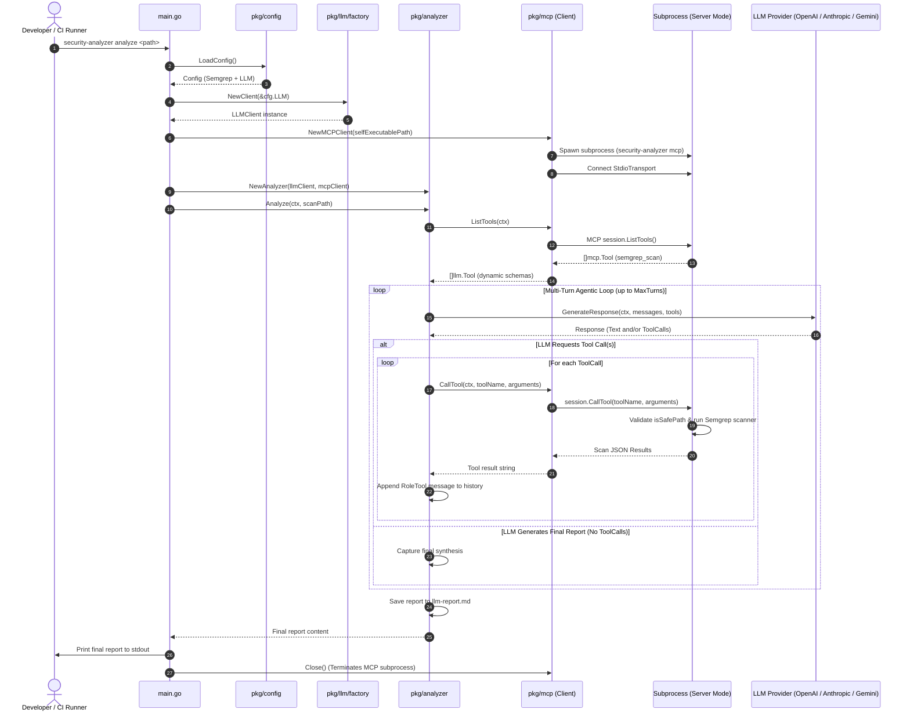

# Architectural Specification: LLM Integration

## 1. Overview & Goals

The **LLM Integration** provides intelligent, automated security audits and vulnerability synthesis within the `security-analyzer` Go application. It pairs Large Language Models (LLMs) with our embedded Model Context Protocol (MCP) server, allowing the AI to dynamically execute local Semgrep scans, inspect codebase security findings, filter false positives, and produce structured, actionable remediation reports.

### Primary Goals
- **Multi-Provider Support**: Seamlessly switch between LLM providers (OpenAI, Anthropic Claude, Google Gemini) via environment configuration without code changes.
- **Dynamic Tool Execution**: Utilize the Model Context Protocol (MCP) over standard I/O (stdio) to dynamically discover and invoke scanning tools (`semgrep_scan`) in an isolated subprocess.
- **Agentic Multi-Turn Analysis**: Orchestrate iterative interactions where the LLM requests scans, inspects results, and generates a structured audit report grouped by severity.
- **Report Persistence**: Emit synthesized reports directly to standard output (`stdout`) and save them to markdown artifacts (`llm-report.md`) for CI/CD archiving and human review.
- **Modular & Decoupled Architecture**: Maintain clear separation of concerns across configuration loading, provider clients, MCP subprocess management, and analysis orchestration, establishing the foundation for future remote API routes.

---

## 2. Architecture and Data Flow

### Sequence Diagram: LLM Analysis Execution (`security-analyzer analyze <path>`)



---

## 3. Multi-Provider LLM Abstraction

All LLM operations are abstracted behind a unified interface in `pkg/llm`, ensuring that provider-specific serialization, authentication, and endpoint protocols remain fully decoupled from the core application logic.

### Core Interfaces & Models ([pkg/llm/client.go](file:///Users/aponte/personal_workspace/repos/security-analyzer/pkg/llm/client.go))

```go
type MessageRole string

const (
    RoleSystem    MessageRole = "system"
    RoleUser      MessageRole = "user"
    RoleAssistant MessageRole = "assistant"
    RoleTool      MessageRole = "tool"
)

type Message struct {
    Role       MessageRole `json:"role"`
    Content    string      `json:"content"`
    Name       string      `json:"name,omitempty"`
    ToolCalls  []ToolCall  `json:"tool_calls,omitempty"`
    ToolCallID string      `json:"tool_call_id,omitempty"`
}

type Tool struct {
    Name        string      `json:"name"`
    Description string      `json:"description"`
    Parameters  interface{} `json:"parameters"`
}

type ToolCall struct {
    ID        string `json:"id"`
    Name      string `json:"name"`
    Arguments string `json:"arguments"`
}

type Response struct {
    Content   string     `json:"content"`
    ToolCalls []ToolCall `json:"tool_calls,omitempty"`
}

type LLMClient interface {
    GenerateResponse(ctx context.Context, messages []Message, tools []Tool) (*Response, error)
}
```

### Provider Implementations

1. **OpenAI ([pkg/llm/openai/openai.go](file:///Users/aponte/personal_workspace/repos/security-analyzer/pkg/llm/openai/openai.go))**:
   - Backed by the official `github.com/sashabaranov/go-openai` SDK.
   - Maps `Tool` definitions to `openai.Tool` (`ToolTypeFunction`).
   - Translates `RoleTool` messages into `openai.ChatCompletionMessage` with `ToolCallID`.
   - Supports configurable base URLs and HTTP transports for local testing with mock servers.

2. **Anthropic Claude ([pkg/llm/anthropic/anthropic.go](file:///Users/aponte/personal_workspace/repos/security-analyzer/pkg/llm/anthropic/anthropic.go))**:
   - Directly interfaces with Anthropic's Messages API (`/v1/messages`).
   - Extracts `RoleSystem` messages into the top-level `system` prompt parameter.
   - Translates assistant tool calls to `tool_use` content blocks and maps `RoleTool` findings to `tool_result` content blocks.
   - **Turn Coalescing**: Coalesces consecutive `RoleTool` responses into a single `user` message turn with multiple `tool_result` blocks, strictly complying with Anthropic's role alternation requirement (`user` $\leftrightarrow$ `assistant`).

3. **Google Gemini ([pkg/llm/gemini/gemini.go](file:///Users/aponte/personal_workspace/repos/security-analyzer/pkg/llm/gemini/gemini.go))**:
   - Directly interfaces with Google's Gemini `generateContent` API (`/v1beta/models/{model}:generateContent`).
   - Extracts `RoleSystem` messages into `systemInstruction`.
   - Maps tool schemas into `FunctionDeclarations` and maps tool calls to `functionCall` parts.
   - **Part Coalescing**: Coalesces consecutive function responses into a single `user` turn with multiple `functionResponse` parts, strictly complying with Gemini's multi-turn alternation rules.

### Provider Factory ([pkg/llm/factory/factory.go](file:///Users/aponte/personal_workspace/repos/security-analyzer/pkg/llm/factory/factory.go))
The factory instantiates the requested provider based on `config.LLMConfig`:
```go
func NewClient(cfg *config.LLMConfig) (llm.LLMClient, error)
```

---

## 4. MCP Client & Dynamic Tool Discovery

The integration adopts a self-contained client-server architecture using the official Model Context Protocol Go SDK (`github.com/modelcontextprotocol/go-sdk`):

### Subprocess Management ([pkg/mcp/client.go](file:///Users/aponte/personal_workspace/repos/security-analyzer/pkg/mcp/client.go))
- **Executable Discovery**: When running `security-analyzer analyze`, the client locates its own binary on disk (`os.Executable()`) and spawns a child process with the `mcp` argument (`security-analyzer mcp`).
- **Stdio Isolation**: The parent client and child server communicate across standard I/O streams using `mcp.CommandTransport`. All logging on both sides is directed to `os.Stderr` or standard loggers to prevent corrupting the JSON-RPC channel.
- **Dynamic Tool Listing**: The client queries available tools dynamically via `session.ListTools(ctx, nil)` and translates them into `[]llm.Tool`. No tool schemas are hardcoded in the client, allowing new tools registered on the server to become immediately available to the LLM.

---

## 5. Analyzer Engine ([pkg/analyzer/analyzer.go](file:///Users/aponte/personal_workspace/repos/security-analyzer/pkg/analyzer/analyzer.go))

The `Analyzer` orchestrator coordinates the multi-turn agentic loop between the LLM and the tool client:

### Key Components
- **`ToolClient` Interface**: Abstract interface requiring `ListTools` and `CallTool`, satisfied by `*mcp.MCPClient` and mock clients.
- **Agentic Loop**:
  1. Dynamically discovers MCP tools.
  2. Submits initial context: expert system prompt + scan path target.
  3. Evaluates LLM responses:
     - If the model returns `ToolCalls`, parses arguments, invokes `toolClient.CallTool`, appends findings as `RoleTool` messages, and continues the loop.
     - If the model returns a final text report (no `ToolCalls`), terminates the loop.
  4. Enforces safety limits (`MaxTurns`, default: 10 iterations) to prevent infinite recursion.
  5. Saves the markdown report to `llm-report.md` (or custom path) and returns the text.

---

## 6. Configuration Management ([pkg/config/config.go](file:///Users/aponte/personal_workspace/repos/security-analyzer/pkg/config/config.go))

The configuration loader unifies settings for both Semgrep scanning and LLM operations from `.env` files and system environment variables:

### Configuration Schema
```go
type Config struct {
    Semgrep SemgrepConfig
    LLM     LLMConfig
}

type LLMConfig struct {
    Provider     string // openai, anthropic, gemini (default: openai)
    Model        string // Model identifier (e.g. gpt-4o-mini, claude-3-5-sonnet-latest, gemini-2.5-flash)
    OpenAIKey    string // OPENAI_API_KEY
    AnthropicKey string // ANTHROPIC_API_KEY
    GeminiKey    string // GEMINI_API_KEY
}
```

### Resolution Logic & Defaults
- **Case-Insensitive Normalization**: `provider` and `model` values are trimmed and converted to lowercase.
- **Default Models**:
  - `openai` $\rightarrow$ `gpt-4o-mini`
  - `anthropic` $\rightarrow$ `claude-3-5-sonnet-latest`
  - `gemini` $\rightarrow$ `gemini-2.5-flash`

---

## 7. Code Structure

```
security-analyzer/
├── main.go                     # CLI entrypoint for scan, mcp, and analyze modes
├── pkg/
│   ├── analyzer/
│   │   ├── analyzer.go         # Agentic tool calling loop and report persistence
│   │   └── analyzer_test.go    # Unit tests with mock LLM & Tool clients
│   ├── config/
│   │   ├── config.go           # Unified configuration struct and environment loader
│   │   └── config_test.go      # Unit tests for Semgrep and LLM configuration
│   ├── llm/
│   │   ├── client.go           # Core interfaces (LLMClient, Message, Tool, Response)
│   │   ├── factory/
│   │   │   ├── factory.go      # Provider constructor factory
│   │   │   └── factory_test.go # Factory unit tests
│   │   ├── openai/
│   │   │   ├── openai.go       # OpenAI implementation via go-openai
│   │   │   └── openai_test.go  # Mock HTTP server unit tests
│   │   ├── anthropic/
│   │   │   ├── anthropic.go    # Anthropic Messages API client with turn coalescing
│   │   │   └── anthropic_test.go # Mock HTTP server unit tests
│   │   └── gemini/
│   │       ├── gemini.go       # Google Gemini generateContent client with part coalescing
│   │       └── gemini_test.go  # Mock HTTP server unit tests
│   ├── mcp/
│   │   ├── client.go           # MCP subprocess client & dynamic tool discovery
│   │   ├── server.go           # MCP server lifecycle & Stdio transport
│   │   ├── tools.go            # Tool definitions (semgrep_scan) & safety validator
│   │   └── tools_test.go       # Path traversal security tests
│   ├── scanner/
│   │   └── semgrep/            # Semgrep CLI execution and JSON parsing
│   └── report/                 # Markdown and GitHub step summary reporters
└── docs/
    └── specs/
        ├── semgrep-integration.md # Semgrep SAST specification
        └── llm-integration.md     # [This file] LLM integration specification
```

---

## 8. Testing Strategy & Quality Assurance

### Local Unit Testing
Every package includes exhaustive unit tests that run independently of external API credentials using Go's standard `net/http/httptest` package:
- **`pkg/llm/openai`**: Tests text completions, tool call requests, multi-turn tool message mappings, and error handling against mock endpoints.
- **`pkg/llm/anthropic`**: Tests text completions, tool calls, and single/multiple `tool_result` message coalescing.
- **`pkg/llm/gemini`**: Tests text completions, function calls, and single/multiple `FunctionResponse` part coalescing.
- **`pkg/llm/factory`**: Tests provider routing, missing key detection, and invalid provider error handling.
- **`pkg/analyzer`**: Tests single-turn synthesis, multi-turn tool calling, multiple parallel tool calls in one turn, iteration limit termination, and report file generation.
- **`pkg/config`**: Tests environment variable overrides, defaults, and mixed-case provider strings.

### Quality Commands
```bash
make fmt      # Formats code using goimports and gofumpt
make vet      # Runs go vet static analysis
make lint     # Runs golangci-lint
make test     # Runs all package unit tests
make build    # Compiles binary to ./out/security-analyzer
```
