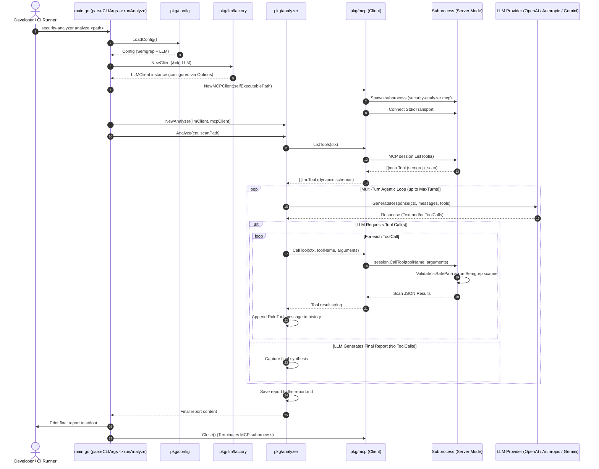
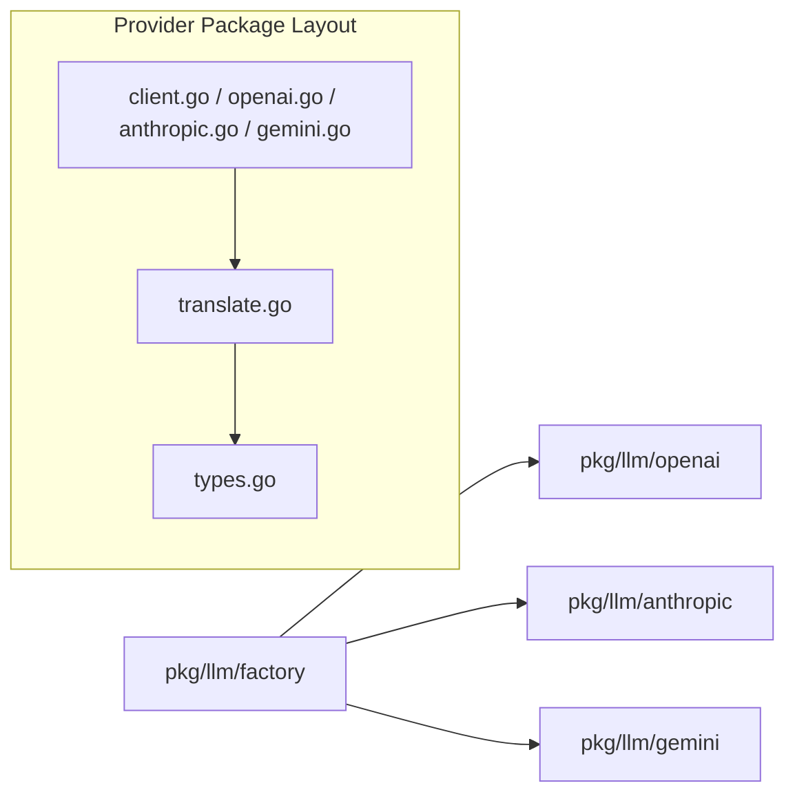

# Architectural Specification: LLM Integration & Provider Architecture

## 1. Overview & Goals

The **LLM Integration** provides intelligent, automated security audits and vulnerability synthesis within the `security-analyzer` Go application. It pairs Large Language Models (LLMs) with our embedded Model Context Protocol (MCP) server, allowing the AI to dynamically execute local Semgrep scans, inspect codebase security findings, filter false positives, and produce structured, actionable remediation reports.

### Primary Goals
- **Multi-Provider Support**: Seamlessly switch between LLM providers (OpenAI, Anthropic Claude, Google Gemini) via environment configuration without code changes.
- **Dynamic Tool Execution**: Utilize the Model Context Protocol (MCP) over standard I/O (stdio) to dynamically discover and invoke scanning tools (`semgrep_scan`) in an isolated subprocess.
- **Agentic Multi-Turn Analysis**: Orchestrate iterative interactions where the LLM requests scans, inspects results, and generates a structured audit report grouped by severity.
- **Functional Options Pattern**: Support immutable, idiomatic client construction (`WithHTTPClient`, `WithEndpoint`/`WithBaseURL`, `WithMaxTokens`) across all provider packages for production and test environments.
- **Modular File & Function Decomposition**: Isolate wire format models (`types.go`), translation algorithms (`translate.go`), and client execution logic (`client.go`) into focused, single-responsibility files.
- **Report Persistence**: Emit synthesized reports directly to standard output (`stdout`) and save them to markdown artifacts (`llm-report.md`) for CI/CD archiving and human review.
- **Modular CLI Architecture**: Decouple CLI argument parsing, failure policy checks, and command execution runners (`runMCP`, `runAnalyze`, `runScan`) into testable pure functions in `main.go`.

---

## 2. Architecture and Data Flow

### Sequence Diagram: LLM Analysis Execution (`security-analyzer analyze <path>`)



---

## 3. Multi-Provider LLM Abstraction

All LLM operations are abstracted behind a unified interface in `pkg/llm`, ensuring that provider-specific serialization, authentication, and endpoint protocols remain fully decoupled from the core application logic.

### Core Interfaces & Transport Models ([pkg/llm/client.go](file:///Users/aponte/personal_workspace/repos/security-analyzer/pkg/llm/client.go))

```go
type MessageRole string

const (
    RoleSystem    MessageRole = "system"
    RoleUser      MessageRole = "user"
    RoleAssistant MessageRole = "assistant"
    RoleTool      MessageRole = "tool"
)

type Message struct {
    Role       MessageRole `json:"role"`
    Content    string      `json:"content"`
    Name       string      `json:"name,omitempty"`
    ToolCalls  []ToolCall  `json:"tool_calls,omitempty"`
    ToolCallID string      `json:"tool_call_id,omitempty"`
}

type Tool struct {
    Name        string      `json:"name"`
    Description string      `json:"description"`
    Parameters  interface{} `json:"parameters"` // JSON Schema structure
}

type ToolCall struct {
    ID        string `json:"id"`
    Name      string `json:"name"`
    Arguments string `json:"arguments"`
}

type Response struct {
    Content   string     `json:"content"`
    ToolCalls []ToolCall `json:"tool_calls,omitempty"`
}

type LLMClient interface {
    GenerateResponse(ctx context.Context, messages []Message, tools []Tool) (*Response, error)
}

// HTTPClient abstracts HTTP request execution across LLM providers and test mocks.
type HTTPClient interface {
    Do(req *http.Request) (*http.Response, error)
}
```

---

## 4. Provider Architecture & Functional Options

Each provider is implemented as an independent package adhering to standard Go idiomatic conventions and decomposed into single-responsibility units:



### 1. OpenAI ([pkg/llm/openai](file:///Users/aponte/personal_workspace/repos/security-analyzer/pkg/llm/openai))
- **`openai.go`**: Contains `Client` struct, Functional Options (`WithHTTPClient`, `WithBaseURL`), and `GenerateResponse`. Backward-compatible alias `type OpenAIClient = Client` is preserved.
- **`translate.go`**: Decoupled helpers:
  - `translateMessages`: Converts domain `llm.Message` slice to `[]openai.ChatCompletionMessage`.
  - `translateMessage`: Maps individual message roles, content, and `ToolCalls`.
  - `translateTools`: Maps `[]llm.Tool` to `[]openai.Tool` (`ToolTypeFunction`).
  - `translateResponseToolCalls`: Maps response tool calls back to domain `[]llm.ToolCall`.

### 2. Anthropic Claude ([pkg/llm/anthropic](file:///Users/aponte/personal_workspace/repos/security-analyzer/pkg/llm/anthropic))
- **`anthropic.go`**: Contains `Client` struct, Functional Options (`WithHTTPClient`, `WithEndpoint`, `WithMaxTokens`), and `GenerateResponse`.
- **`types.go`**: Encapsulates internal wire structs (`anthropicRequest`, `anthropicMessage`, `anthropicContent`, `anthropicTool`, `anthropicResponse`, `anthropicError`).
- **`translate.go`**: Modular translation algorithms:
  - `appendSystemText`: Aggregates multiple system messages into a top-level prompt string.
  - `translateUserMessage`: Builds user text content blocks.
  - `translateAssistantMessage` / `translateToolCall`: Maps assistant turns and `tool_use` blocks.
  - `appendToolResultMessage`: Maps `tool_result` blocks and **coalesces consecutive tool results into the preceding user turn**, strictly fulfilling Anthropic's alternating role requirements (`user` $\leftrightarrow$ `assistant`).

### 3. Google Gemini ([pkg/llm/gemini](file:///Users/aponte/personal_workspace/repos/security-analyzer/pkg/llm/gemini))
- **`gemini.go`**: Contains `Client` struct, Functional Options (`WithHTTPClient`, `WithEndpointBase`), and `GenerateResponse`.
- **`types.go`**: Encapsulates internal wire structs (`geminiRequest`, `geminiContent`, `geminiPart`, `geminiFunctionCall`, `geminiFunctionResponse`, `geminiTool`, `geminiResponse`, `geminiError`).
- **`translate.go`**: Modular translation algorithms:
  - `appendSystemText`: Aggregates system prompt into `systemInstruction`.
  - `translateUserContent`: Builds user text parts.
  - `translateModelContent` / `translateFunctionCallPart`: Maps model turns and `functionCall` parts.
  - `appendToolResponseContent`: Maps `FunctionResponse` parts and **coalesces consecutive responses into the preceding user turn**, strictly fulfilling Gemini's turn alternation requirements.

### 4. Provider Factory ([pkg/llm/factory](file:///Users/aponte/personal_workspace/repos/security-analyzer/pkg/llm/factory))
The factory constructs clients using standardized `NewClientWithConfig`:
```go
func NewClient(cfg *config.LLMConfig) (llm.LLMClient, error)
```

---

## 5. MCP Subprocess Client & Dynamic Discovery

The client-server integration is implemented using the Model Context Protocol Go SDK (`github.com/modelcontextprotocol/go-sdk`):
- **Subprocess Management**: Spawns `./out/security-analyzer mcp` as an isolated child process via `os.Executable()`.
- **Transport Isolation**: Stdio streams are exclusively used for JSON-RPC message exchange. Application logs are redirected to `os.Stdout` (in CLI mode) or `os.Stderr` (in MCP mode) to prevent stream corruption.
- **Dynamic Tool Listing**: Discovers available tools at runtime via `session.ListTools(ctx, nil)`, translating schema structures dynamically into `[]llm.Tool`.

---

## 6. Analyzer Engine ([pkg/analyzer](file:///Users/aponte/personal_workspace/repos/security-analyzer/pkg/analyzer))

The `Analyzer` orchestrator executes the agentic feedback loop:
- **`ToolClient` Interface**: Abstract interface requiring `ListTools` and `CallTool`.
- **Multi-Turn Loop**:
  1. Dynamically loads tool schemas from the MCP client.
  2. Sends initial prompt context to the LLM.
  3. Evaluates responses:
     - If tool calls are requested: parses arguments, calls the tool client, appends `RoleTool` findings, and requests the next turn.
     - If text report is synthesized: saves report to disk (`llm-report.md` by default or custom path) and returns output.
  4. Enforces execution limits (`MaxTurns`, default 10) to guard against unbounded execution loops.

---

## 7. Modular CLI Entrypoint Architecture ([main.go](file:///Users/aponte/personal_workspace/repos/security-analyzer/main.go))

The entrypoint is organized into distinct, testable components:
- **`parseCLIArgs(args []string) cliOptions`**: Pure CLI argument parser handling subcommands (`mcp`, `analyze`, `scan`) and positional scan paths. Tested in [main_test.go](file:///Users/aponte/personal_workspace/repos/security-analyzer/main_test.go).
- **`runMCP(ctx context.Context, cfg *config.SemgrepConfig) error`**: MCP server runner.
- **`runAnalyze(ctx context.Context, cfg *config.Config, scanPath string) error`**: LLM analysis runner.
- **`runScan(ctx context.Context, cfg *config.SemgrepConfig, scanPath string) error`**: Direct Semgrep scanner runner.
- **`shouldFailBuild(failOn string, results []semgrep.Result) bool`**: Pure evaluation of build failure thresholds (`ERROR`, `WARNING`, `INFO`). Tested in [main_test.go](file:///Users/aponte/personal_workspace/repos/security-analyzer/main_test.go).

---

## 8. Code Structure Map

```
security-analyzer/
├── main.go                     # Modular CLI entrypoint & command dispatchers
├── main_test.go                # Unit tests for CLI parsing & fail policy logic
├── pkg/
│   ├── analyzer/
│   │   ├── analyzer.go         # Agentic tool calling loop and report persistence
│   │   └── analyzer_test.go    # Unit tests with mock LLM & Tool clients
│   ├── config/
│   │   ├── config.go           # Unified configuration struct and environment loader
│   │   └── config_test.go      # Unit tests for Semgrep and LLM configuration
│   ├── llm/
│   │   ├── client.go           # Core interfaces (LLMClient, HTTPClient, Message, Tool)
│   │   ├── factory/
│   │   │   ├── factory.go      # Provider constructor factory
│   │   │   └── factory_test.go # Factory unit tests
│   │   ├── openai/
│   │   │   ├── openai.go       # OpenAI client & functional options
│   │   │   ├── translate.go    # OpenAI message & tool translation
│   │   │   └── openai_test.go  # Unit tests using functional options & mock servers
│   │   ├── anthropic/
│   │   │   ├── anthropic.go    # Anthropic client & functional options
│   │   │   ├── translate.go    # Anthropic message & tool translation with turn coalescing
│   │   │   ├── types.go        # Anthropic wire format request/response structs
│   │   │   └── anthropic_test.go # Unit tests using functional options & mock servers
│   │   └── gemini/
│   │       ├── gemini.go       # Gemini client & functional options
│   │       ├── translate.go    # Gemini message & function translation with part coalescing
│   │       ├── types.go        # Gemini wire format request/response structs
│   │       └── gemini_test.go  # Unit tests using functional options & mock servers
│   ├── mcp/
│   │   ├── client.go           # MCP subprocess client & dynamic tool discovery
│   │   ├── server.go           # MCP server lifecycle & Stdio transport
│   │   ├── tools.go            # Tool definitions (semgrep_scan) & path safety validator
│   │   └── tools_test.go       # Path traversal security containment tests
│   ├── scanner/
│   │   └── semgrep/            # Semgrep CLI execution and JSON parsing
│   └── report/                 # Markdown and GitHub step summary reporters
└── docs/
    ├── README.md               # Documentation harness index & navigation guide
    └── specs/
        ├── semgrep-integration.md # Semgrep SAST specification
        └── llm-integration.md     # [This file] LLM integration & architecture specification
```

---

## 9. Testing & Verification

```bash
make fmt      # Formats code using goimports and gofumpt
make vet      # Runs go vet static analysis
make lint     # Runs golangci-lint
make test     # Runs all package unit tests
make build    # Compiles binary to ./out/security-analyzer
```
