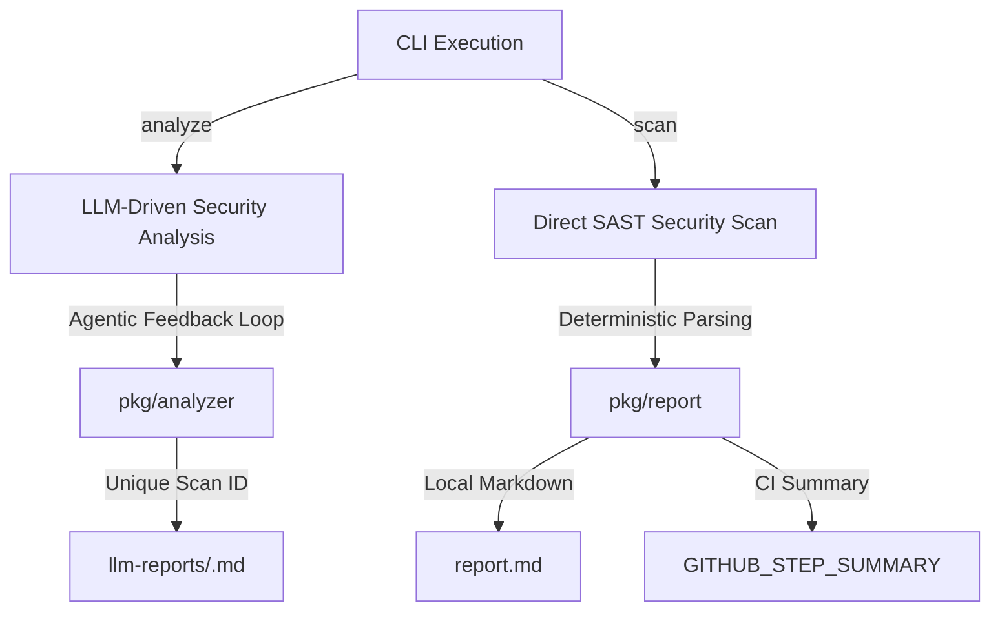
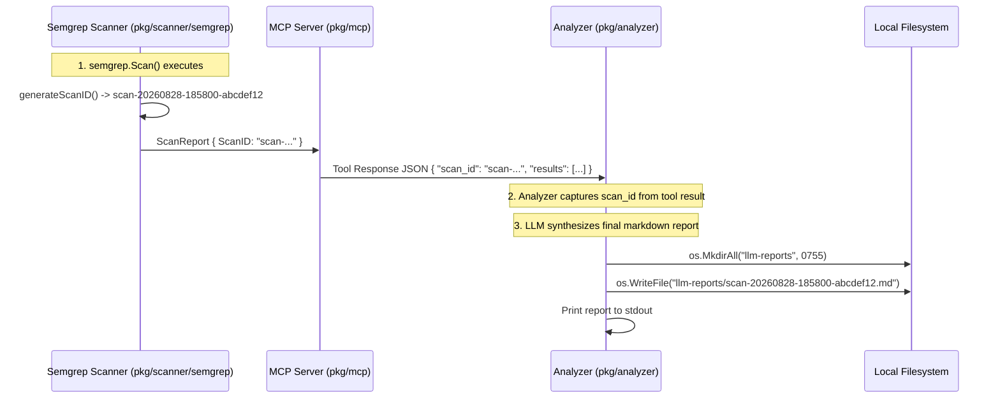

# Report Generation & Artifact Specification

This specification defines the architectural design, lifecycle, file layout, and schema for security report generation in `security-analyzer`.

---

## 1. Overview & Reporting Modes

`security-analyzer` produces two distinct tiers of security reports depending on the execution mode:



1. **LLM-Synthesized Reports (`analyze` mode)**:
   - Contextual, AI-synthesized audit reports generated by the agentic loop.
   - Written to the `llm-reports/` directory and dynamically named after the Semgrep scan ID: `llm-reports/<scan_id>.md`.
2. **Deterministic SAST Reports (`scan` mode)**:
   - Structured markdown reports rendered by [pkg/report/markdown.go](file:///Users/aponte/personal_workspace/repos/security-analyzer/pkg/report/markdown.go) and written to `report.md`.
   - GitHub Actions CI summaries emitted directly to `$GITHUB_STEP_SUMMARY`.

---

## 2. Scan ID Generation & Lifecycle

Every Semgrep scan generates a unique, human-readable, and chronologically sortable **Scan ID**.

### Identifier Format
$$\text{scan-YYYYMMDD-HHMMSS-HEX}$$
*Example*: `scan-20260828-185800-abcdef12`

### Lifecycle Flow


### Type Definition
In [pkg/scanner/semgrep/types.go](file:///Users/aponte/personal_workspace/repos/security-analyzer/pkg/scanner/semgrep/types.go):
```go
type ScanReport struct {
	ScanID  string   `json:"scan_id,omitempty"`
	Version string   `json:"version"`
	Results []Result `json:"results"`
	Errors  []Error  `json:"errors"`
	Paths   Paths    `json:"paths"`
}
```

---

## 3. Directory Layout & Persistence

### Default Layout
```
security-analyzer/
├── llm-reports/                                    # Created automatically by Analyzer
│   ├── scan-20260828-185800-abcdef12.md           # LLM Audit Report for Scan A
│   └── scan-20260828-191500-1a2b3c4d.md           # LLM Audit Report for Scan B
├── report.md                                      # Direct SAST markdown report (scan mode)
```

### Configurable Analyzer Options
In [pkg/analyzer/analyzer.go](file:///Users/aponte/personal_workspace/repos/security-analyzer/pkg/analyzer/analyzer.go):
```go
type Options struct {
	MaxTurns   int    // Maximum agentic turns (default: 10)
	OutputDir  string // Output directory (default: "llm-reports")
	OutputFile string // Base output filename (default: "llm-report.md", overridden by scan_id)
}
```

- **Automatic Directory Creation**: `saveReport` invokes `os.MkdirAll(dir, 0755)` prior to writing, ensuring nested paths succeed without requiring manual setup.
- **Dynamic File Naming Logic**:
  - If `OutputFile` is the default (`"llm-report.md"`) and a `scan_id` was captured from the scan tool, the report file is automatically saved as `<scan_id>.md`.
  - If a caller supplies an explicit custom filename (e.g. `Options{OutputFile: "audit.md"}`), the explicit filename is honored.

---

## 4. Report Structure & Schema

### A. LLM Security Audit Report (`llm-reports/<scan_id>.md`)
Synthesized by the LLM following the expert system prompt:
1. **Executive Summary**: Overview of codebase security posture, scope, and high-level assessment.
2. **Findings Grouped by Severity**:
   - **Critical / High**: Immediate security vulnerabilities (e.g. SQL Injection, Command Injection, hardcoded secrets).
   - **Medium / Low**: Best-practice deviations, weak cryptographic configurations, informational items.
3. **Code Evidence & Context**: Exact file paths, line numbers, and relevant source code snippets.
4. **Remediation Plan**: Actionable steps, code refactoring guidance, and defensive hardening recommendations.

### B. Direct SAST Markdown Report (`report.md`)
Generated deterministically by [pkg/report/markdown.go](file:///Users/aponte/personal_workspace/repos/security-analyzer/pkg/report/markdown.go):
- Header with scan statistics (total files scanned, total findings, errors).
- Severity sections (`ERROR`, `WARNING`, `INFO`).
- Code blocks highlighting offending lines and file locations (`path:line:col`).
- Semgrep error diagnostics (if any).

---

## 5. Testing & Quality Strategy

1. **Unit Testing ([pkg/analyzer/analyzer_test.go](file:///Users/aponte/personal_workspace/repos/security-analyzer/pkg/analyzer/analyzer_test.go))**:
   - `TestAnalyzer_Analyze_OutputDirCreation`: Verifies automatic parent directory creation.
   - `TestAnalyzer_Analyze_NamedAfterScanID`: Verifies report file is named after captured `scan_id`.
2. **Reporter Unit Testing ([pkg/report/markdown_test.go](file:///Users/aponte/personal_workspace/repos/security-analyzer/pkg/report/markdown_test.go))**:
   - Verifies severity grouping, code context formatting, and file creation.
