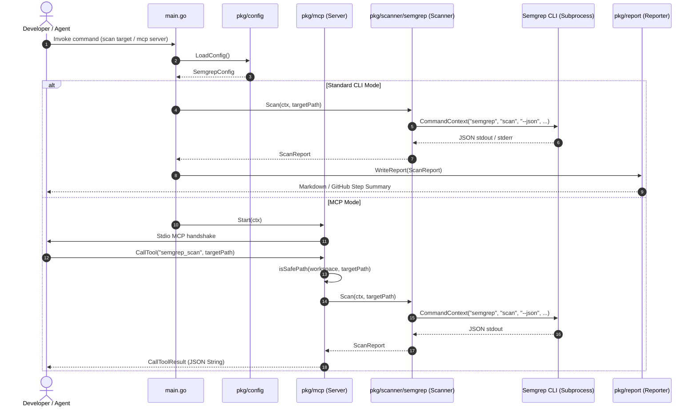

# Architectural Specification: Semgrep Integration

## 1. Overview & Goals
The **Semgrep Integration** provides automated static application security testing (SAST) capabilities within the `security-analyzer` Go application. It targets local codebases, analyzes them against defined security patterns, and generates comprehensive compliance reports. 

### Primary Goals
- **Automated Scanning**: Provide standard static analysis via the Semgrep CLI.
- **Reporting**: Output findings in multiple formats: Markdown reports for human consumption, and GitHub Actions step summaries for automated pipelines.
- **Dual-Mode Execution**:
  - **Standard CLI Mode**: Execute as a direct shell tool via subcommands or CLI flags.
  - **Model Context Protocol (MCP) Mode**: Run as a stdio-based MCP server to expose the `semgrep_scan` tool to LLM subagents and IDE plugins.
- **Workspace Security**: Enforce directory traversal boundaries in multi-tenant or sandboxed agentic environments.

---

## 2. Architecture and Data Flow

### Sequence Diagram: Scan Request (CLI vs. MCP)


### Core Architecture Component Breakdown
1. **Configuration**: Initializes scanning parameters from environment variables (e.g. `SEMGREP_RULES`, `SEMGREP_FAIL_ON`) or `.env` files.
2. **Execution Subprocess**: Safely invokes `semgrep` with appropriate flags, streaming output to buffers to prevent memory leaks and capturing standard errors.
3. **Parsing Engine**: Unmarshals the JSON stdout from Semgrep into a structured Go memory model.
4. **Export Engine**: Dispatches findings to configured report outputs (Markdown files or CI summary files).

---

## 3. Model Context Protocol (MCP) Mode

The Model Context Protocol (MCP) mode allows the tool to run as a backend utility serving LLM agents.

### Subcommand Usage
The application switches to MCP server mode when invoked with the `mcp` subcommand:
```bash
./out/security-analyzer mcp
```

### Transport Channel
- Uses standard input/output (**stdio**) transport channels to communicate.
- Since standard output is exclusively reserved for the JSON-RPC communication defined by the MCP protocol, **all application-level logging is redirected to `os.Stderr`**. This prevents logs from corrupting the JSON-RPC streams.

### Directory Traversal Protection
To prevent malicious prompts or agent errors from scanning arbitrary files on the host system:
- The [isSafePath](file:///Users/aponte/personal_workspace/security-analyzer/pkg/mcp/tools.go#L21) function calculates the absolute path of both the allowed workspace and the target directory.
- It determines the relative relationship using `filepath.Rel()`.
- If the relative path starts with `..`, it indicates the target lies outside the root workspace, and the request is rejected with a containment violation error.

---

## 4. Code Structure

The Semgrep integration is divided into distinct, single-responsibility Go packages:

### config ([pkg/config/config.go](file:///Users/aponte/personal_workspace/security-analyzer/pkg/config/config.go))
Responsible for loading configurations, verifying local environments, and defining parameters:
- [SemgrepConfig](file:///Users/aponte/personal_workspace/security-analyzer/pkg/config/config.go#L12): Holds execution fields including rules config, fail policy, timeouts, and CLI binary presence.
- [LoadConfig](file:///Users/aponte/personal_workspace/security-analyzer/pkg/config/config.go#L22): Scans system environment variables and loads files using `github.com/joho/godotenv`. Checks for the `semgrep` binary presence via `exec.LookPath`.

### scanner/semgrep ([pkg/scanner/semgrep/semgrep.go](file:///Users/aponte/personal_workspace/security-analyzer/pkg/scanner/semgrep/semgrep.go))
Executes the physical binary and serializes results:
- [SemgrepScanner](file:///Users/aponte/personal_workspace/security-analyzer/pkg/scanner/semgrep/semgrep.go#L15): Implements scanner logic.
- [Scan](file:///Users/aponte/personal_workspace/security-analyzer/pkg/scanner/semgrep/semgrep.go#L25): Prepares commands using Go's `os/exec` package, pipes standard buffers, and manages execution context.
- [ScanReport](file:///Users/aponte/personal_workspace/security-analyzer/pkg/scanner/semgrep/types.go#L44): Maps structural outputs from `semgrep scan --json`. Holds `ScanID`, `Results`, `Errors`, and `Paths`. Unique `ScanID` is automatically assigned for artifact traceability.

### report ([pkg/report/report.go](file:///Users/aponte/personal_workspace/security-analyzer/pkg/report/report.go))
Exports scan findings to external environments:
- [Reporter](file:///Users/aponte/personal_workspace/security-analyzer/pkg/report/report.go#L8): Interface defining report builders.
- [MarkdownReporter](file:///Users/aponte/personal_workspace/security-analyzer/pkg/report/markdown.go#L13): Formats structural scan findings into markdown files (`report.md` by default) with categorization by severity (`ERROR`, `WARNING`, `INFO`).
- [GitHubReporter](file:///Users/aponte/personal_workspace/security-analyzer/pkg/report/github.go#L11): Checks if the environment contains `GITHUB_STEP_SUMMARY` and appends a markdown summary table and details directly into the step log.

### mcp ([pkg/mcp/server.go](file:///Users/aponte/personal_workspace/security-analyzer/pkg/mcp/server.go))
Defines the MCP server runtime:
- [Server](file:///Users/aponte/personal_workspace/security-analyzer/pkg/mcp/server.go#L13): Struct managing server lifecycle.
- [Start](file:///Users/aponte/personal_workspace/security-analyzer/pkg/mcp/server.go#L51): Registers tools and configures StdioTransport.
- [registerSemgrepScanTool](file:///Users/aponte/personal_workspace/security-analyzer/pkg/mcp/tools.go#L46): Declares the `semgrep_scan` tool schema and defines callback behaviors.

---

## 5. Testing & CI/CD

### Local Testing
All components are validated locally using the unit test suite.
To execute unit tests:
```bash
make test
```
This triggers `go test -v ./...` which verifies configuration parsing, path containment checks, and markdown formats.

### CI/CD Workflow
The CI pipeline in [.github/workflows/ci.yml](file:///Users/aponte/personal_workspace/security-analyzer/.github/workflows/ci.yml) ensures automatic verification on pushes or pull requests targeting `main`. The pipeline runs sequentially on `ubuntu-latest`:
1. Checkout repository code.
2. Initialize Go (`1.25`).
3. Run `golangci-lint` to check styling compliance.
4. Execute `make build` to check binary compilability.
5. Run `make test` to execute all package unit tests.
